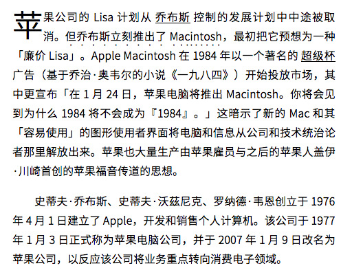
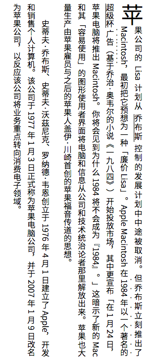

charch.js 中文排版工具
======

[](https://www.npmjs.com/package/charch)
[](https://www.npmjs.com/package/charch)
[](https://www.npmjs.com/package/charch)

Demo: [shuding.github.io/charch/demo/](https://shuding.github.io/charch/demo/)

## 用法

### 安装

NPM:

`$ npm install charch`

### 使用

1. 在 `body` **底部** 插入此脚本：

```html
<script type="text/javascript" src="charch.build.js"></script>
```

2. 在需要排版的元素上加入 `class='charch'`
3. 设置同样是添加 `class` 的形式：
	1. `charch-indent`：段前自动缩进两格
	1. `charch-link`：超链接下划线调整
	1. `charch-pseudo`：（此段）首字加大
	1. `charch-vertical`：竖排
	1. `charch-cjk-latin-space`：中西文自动间隔
	1. `charch-bracket-replace`：直角引号自动替换
	1. `charch-link-space`：超链接左右间隔
	1. `charch-line-height`：行距自动调整
4. 运行 `Charch(document)`

例如：

```html
<div class="charch charch_pseudo charch_vertical">
  <p>段落一</p>
  <p>段落二</p>
  ...
</div>
<script type="text/javascript" src="charch.build.js"></script>
<script type="text/javascript">
  Charch(document);
</script>
```

将生成一段竖排文本，且首字加大。

## 样例

### 正常（窄）


### 首字加大



### 竖排



## 致谢
[https://github.com/vinta/paranoid-auto-spacing](https://github.com/vinta/paranoid-auto-spacing)

## 协议

- 作者：[Shu Ding <ds303077135@gmail.com>](github.com/quietshu)
- 版本：[](https://www.npmjs.com/package/charch)
- 协议：MIT
