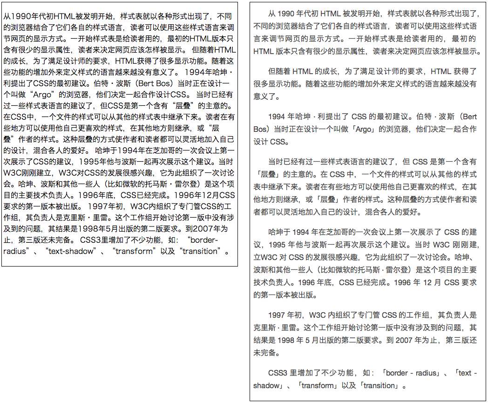

charch.js 中文排版工具
======

Demo 地址：[quietshu.github.io/charch/sample.html](http://quietshu.github.io/charch/sample.html)

Tool 地址：[quietshu.github.io/charch/tool.html](http://quietshu.github.io/charch/tool.html)

项目地址：[github.com/quietshu/charch](github.com/quietshu/charch)

### 权利和协议

- 作者：Shu Ding
- Email：[ds303077135@gmail.com](mailto:ds303077135@gmail.com)
- 项目地址：[github.com/quietshu/charch](github.com/quietshu/charch)
- 版本：1.2
- 协议：GPL 2

### 特点

- 轻便简单
- 纯 JavaScript 实现，不依赖其他库
- 仅作格式处理，CSS 中文样式请使用 Typo、Han CSS 库~~自带 CSS 样式，使用网页兼容字体，考究行距、字距、段距。适合 Windows、Linux、Mac OS X 平台下浏览~~
- 替换公共引号 “ ” 为中文直角引号「」
- ~~替换英文半角字符括号 () 为中文括号（）~~
- 中西文衔接处添加一个半角空格
- 对齐方式设置为左右对齐，`word-break`
- ~~将行首的标点提到上一行末，并悬挂显示（下例中第一行末）~~
- 修复 `p` 标签下默认忽略换行符的问题

### 演示

左边为一个纯 `p` 标签下的文章，右边为添加了 `charch_post` 类之后自动排版的效果。

### 用法

- 将`charch.js`放入网站根目录下

- 在网页头部`</head>`之前加入如下代码：

		
  
- 在需要排版的文章父元素（`
`的上层`
`）加入类`charch_post`。例如：

	原代码：

		

			
半夜写代码

			
真蛋疼

		

	应改成：

		

			
半夜写代码

			
真蛋疼

		

  
  
### 说明 & 待办

- 如何才能更灵活处理字距问题？比如「ACM-ICPC」和「1 - 2」
- 字符集、符号类别需要完善，需要支持所有 CJK 字符和特殊符号
- 中英文混输 word-wrap 如何解决
- 两个标点悬挂 bug 待修复
- 或许可以进一步制作成一个阅读网页优化插件
